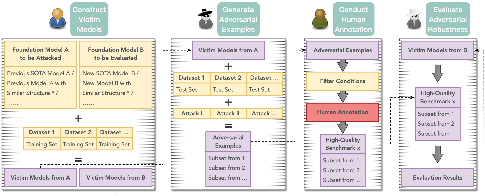
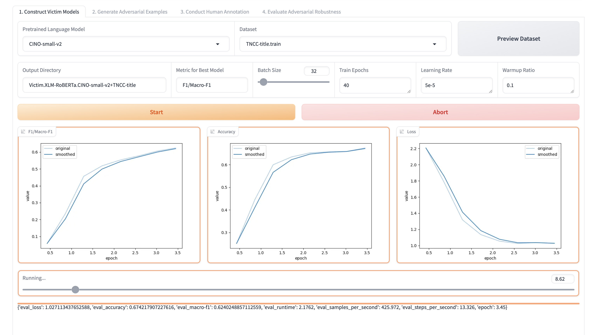
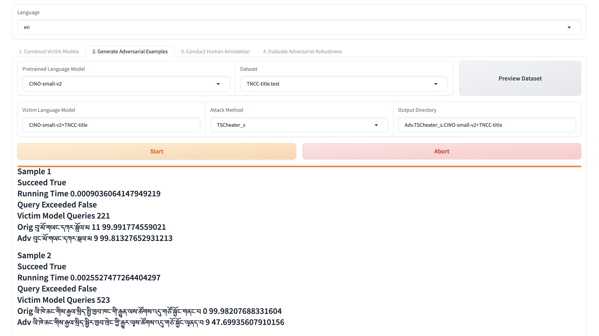
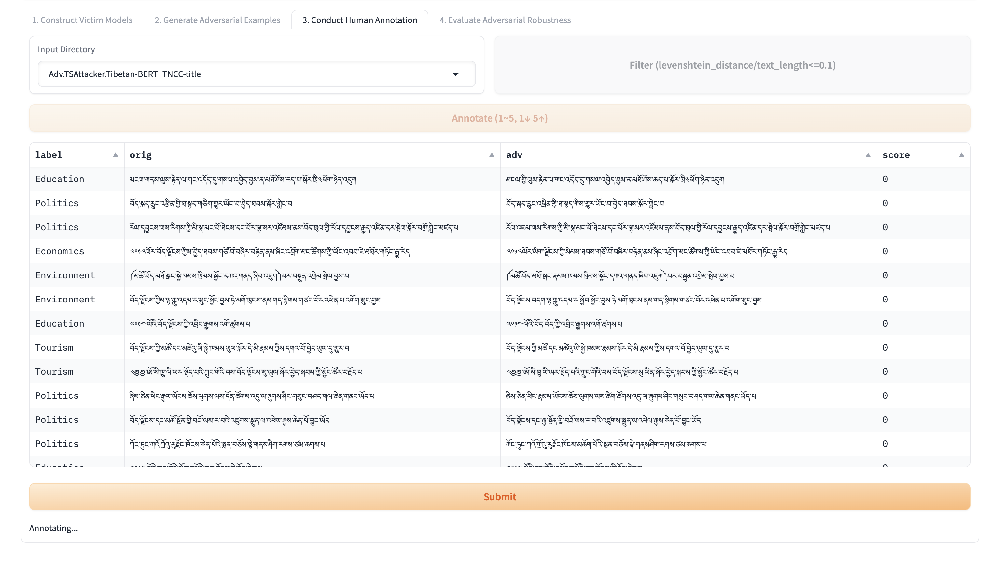
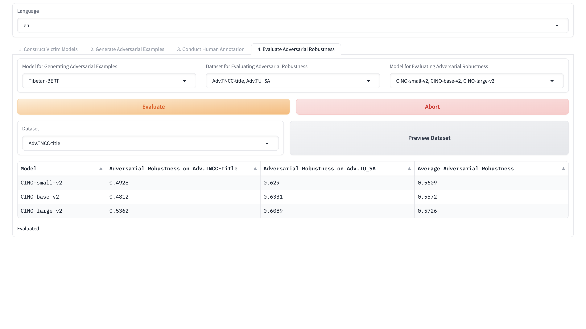

# Human-in-the-Loop Generation of Adversarial Texts: A Case Study on Tibetan Script

## Introduction

DNN-based language models perform excellently on various tasks, but even SOTA LLMs are susceptible to textual adversarial attacks.
Adversarial texts play crucial roles in multiple subfields of NLP.

However, current research has the following issues.

(1) Most textual adversarial attack methods target rich-resourced languages.
How do we generate adversarial texts for less-studied languages?

(2) Most textual adversarial attack methods are prone to generating invalid or ambiguous adversarial texts.
How do we construct high-quality adversarial robustness benchmarks?

(3) New language models may be immune to part of previously generated adversarial texts.
How do we update adversarial robustness benchmarks?

To address the above issues, we introduce _HITL-GAT_, a system based on a general approach to human-in-the-loop generation of adversarial texts.
Additionally, we utilize _HITL-GAT_ to make a case study on Tibetan script which can be a reference for the adversarial research of other less-studied languages.

## Flowchart



## Quickstart

### Requirements

You can `python install -r requirements.txt`.

```requirements
OpenAttack==2.1.1
Levenshtein==0.26.0
psutil==5.9.8
scikit-learn==1.4.2
numpy==1.26.4
pandas==2.2.3
matplotlib==3.8.4
gradio==4.44.0
transformers==4.42.4
datasets==2.18.0
evaluate==0.4.3
accelerate==0.34.2
sentencepiece==0.2.0
torch==1.13.1+cu117
```

### Datasets

You can find the downstream datasets in `data/Dataset.Info/all.json`.

| Downstream Dataset |           Directory           |                 Loader                 |
|:------------------:|:-----------------------------:|:--------------------------------------:|
|   TNCC-document    | `data/Dataset.TNCC-document`  | `data/Dataset.Loader/TNCC-document.py` |
|     TNCC-title     |   `data/Dataset.TNCC-title`   |  `data/Dataset.Loader/TNCC-title.py`   |
|       TU_SA        |     `data/Dataset.TU_SA`      |     `data/Dataset.Loader/TU_SA.py`     |

Also, you can customize your own datasets like above.

### Foundation Models

You can find the foundation models in `data/PLM.*.*`.

| Foundation Model |              Directory               |
|:----------------:|:------------------------------------:|
|   Tibetan-BERT   |     `data/PLM.BERT.Tibetan-BERT`     |
|  CINO-small-v2   | `data/PLM.XLM-RoBERTa.CINO-small-v2` |
|   CINO-base-v2   | `data/PLM.XLM-RoBERTa.CINO-base-v2`  |
|  CINO-large-v2   | `data/PLM.XLM-RoBERTa.CINO-large-v2` |

Also, you can customize your own foundation models like above.

### Victim Models

You can find the victim models (`data/Victim.*.*`) in [our Hugging Face collection](https://huggingface.co/collections/UTibetNLP/tibetan-victim-language-models-669f614ecea872c7211c121c) and the construction process in [our GitHub repository](https://github.com/metaphors/TibetanPLMsFineTuning).

### Others

You can find the attack assists in `data/AttackAssist.*`, the experimental logs in `Adv.*.*` and the first adversarial robustness benchmark for Tibetan script in `data/Dataset.AdvTS`.

### Start

Now, you can `python webui.py` or run the scripts under the `script` dir.

## Screenshots






## Acknowledgments

Thanks to the following open-sourced projects: [OpenAttack](https://aclanthology.org/2021.acl-demo.43/), [Gradio](https://arxiv.org/abs/1906.02569), [LlamaFactory](https://aclanthology.org/2024.acl-demos.38/), [Transformers](https://aclanthology.org/2020.emnlp-demos.6/), [Datasets](https://aclanthology.org/2021.emnlp-demo.21/), and so on.
